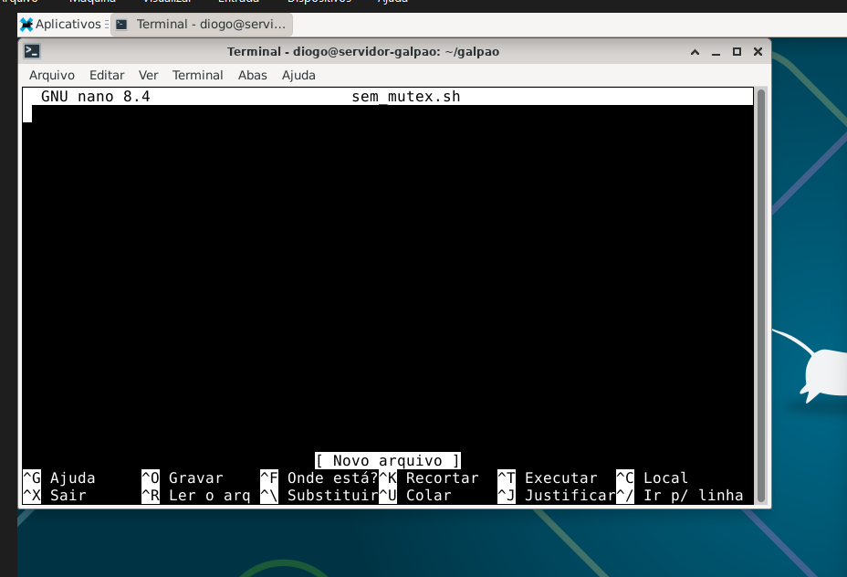
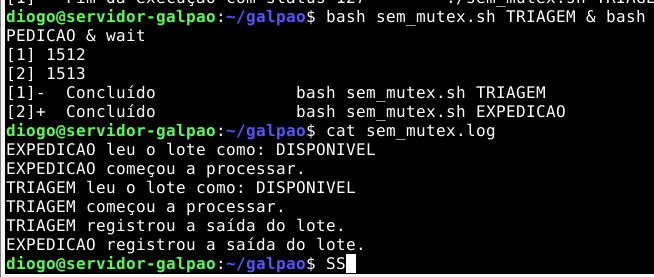
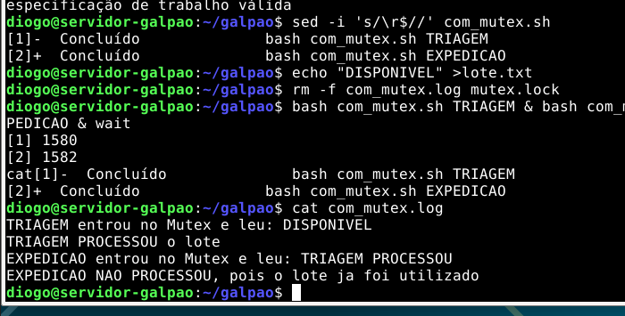

# Titulo: "PBL — Grupo 4: Sincronização com Mutex"

## Participantes:
- Diogo de Oliveira Teixeira
- Jessica Carolino Limonge
- Samuel Oliveira
- Gabriel Dubinski


# PBL — Grupo 4: Sincronização no Sistema de Gestão do Galpão

## 1. Identificação da atividade

- **Disciplina:** Sistemas Operacionais
- **Projeto:** Arquitetura do Sistema de Gestão do Galpão
- **Squad:** Grupo 4 — Sincronização
- **Responsável por esta prática:** Diogo de Oliveira Teixeira
- **Ambiente utilizado:** Oracle VM VirtualBox com Debian 13

## 2. Contexto

O galpão de insumos de saúde possui tarefas de recepção, triagem e expedição executadas concorrentemente. Se duas tarefas acessarem e alterarem o registro do mesmo lote ao mesmo tempo, o sistema poderá registrar duas saídas para um único lote, deixando o estoque inconsistente.

A prática representou a **Triagem** e a **Expedição** como processos concorrentes que compartilham um arquivo chamado `lote.txt`. Esse arquivo simulou o registro de um lote de medicamentos.

## 3. Objetivo do Grupo 4

O objetivo foi demonstrar:

1. O que acontece quando dois processos acessam um dado compartilhado sem sincronização;
2. Como surge uma condição de corrida;
3. O que é uma região crítica;
4. Como um Mutex garante exclusão mútua;
5. Como o comando `flock` pode impedir o processamento duplicado do mesmo lote.

## 4. Conceitos fundamentais

### 4.1 Concorrência

Concorrência ocorre quando duas ou mais tarefas avançam durante o mesmo intervalo de tempo. No experimento, os processos de Triagem e Expedição foram iniciados com `&`, permitindo que fossem executados concorrentemente.

### 4.2 Recurso compartilhado

É um dado ou dispositivo acessado por mais de uma tarefa. Na simulação, o recurso compartilhado foi:

```text
lote.txt
```

Em um sistema real, esse recurso poderia ser uma linha do banco de dados contendo o código, a quantidade e a situação de um lote de medicamentos.

### 4.3 Condição de corrida

A condição de corrida acontece quando o resultado depende da ordem e do momento em que processos concorrentes acessam um recurso compartilhado.

No teste sem proteção, Triagem e Expedição leram `DISPONIVEL` antes que uma delas atualizasse o arquivo. Por isso, as duas acreditaram que poderiam processar o lote.

### 4.4 Região crítica

A região crítica é a parte do programa que acessa ou altera um recurso compartilhado. Nesta atividade, ela compreendeu:

- Ler o estado do lote;
- Verificar se o lote estava disponível;
- Processar o lote;
- Registrar a saída.

### 4.5 Mutex

Mutex significa **exclusão mútua**. Seu objetivo é permitir que somente uma tarefa entre na região crítica por vez.

Quando um processo obtém o Mutex, os outros devem esperar. Após a liberação da trava, o próximo processo pode entrar e consultar o estado atualizado do recurso.

### 4.6 Diferença entre Mutex e semáforo

| Estrutura | Funcionamento |
|---|---|
| Mutex | Permite que apenas uma tarefa acesse a região protegida por vez. |
| Semáforo | Controla uma quantidade definida de acessos simultâneos por meio de um contador. |

O Mutex foi escolhido porque apenas uma tarefa poderia registrar a saída do lote.

## 5. Preparação do ambiente

### 5.1 Configuração da máquina virtual

Foi criada uma máquina no Oracle VM VirtualBox com:

- 2 CPUs;
- 4 GB de memória RAM;
- Disco virtual de 25 GB;
- Debian 13;
- Rede configurada como NAT;
- Inicialização pelo disco óptico durante a instalação;
- GRUB instalado em `/dev/sda`.

### 5.2 Pacotes utilizados

```bash
sudo apt update
sudo apt install nano htop strace util-linux -y
```

| Programa | Utilização |
|---|---|
| `nano` | Criação e edição dos scripts. |
| `htop` | Visualização de processos. |
| `strace` | Observação de chamadas de sistema. |
| `util-linux` | Pacote que fornece o comando `flock`. |

### 5.3 Pasta do experimento

```bash
mkdir -p ~/galpao
cd ~/galpao
```



## 6. Experimento 1 — Execução sem Mutex

### 6.1 Objetivo

Demonstrar que Triagem e Expedição poderiam processar o mesmo lote quando não existisse controle de acesso.

### 6.2 Script `sem_mutex.sh`

```bash
#!/bin/bash

NOME="$1"
STATUS=$(cat lote.txt)

echo "$NOME leu o lote como: $STATUS" >> sem_mutex.log

if [ "$STATUS" = "DISPONIVEL" ]; then
    echo "$NOME começou a processar." >> sem_mutex.log
    sleep 3
    echo "PROCESSADO POR $NOME" > lote.txt
    echo "$NOME registrou a saída do lote." >> sem_mutex.log
fi
```

O `sleep 3` simulou o tempo gasto no processamento. Durante essa espera, o segundo processo conseguiu ler o estado antigo do lote.

### 6.3 Preparação e execução

```bash
chmod +x sem_mutex.sh
echo "DISPONIVEL" > lote.txt
rm -f sem_mutex.log
bash sem_mutex.sh TRIAGEM & bash sem_mutex.sh EXPEDICAO & wait
cat sem_mutex.log
```

O símbolo `&` iniciou cada processo em segundo plano. O comando `wait` fez o terminal aguardar o término dos dois processos.

### 6.4 Resultado observado



O log demonstrou que:

1. A Expedição leu o lote como disponível;
2. A Triagem também leu o lote como disponível;
3. As duas iniciaram o processamento;
4. A Triagem registrou a saída;
5. A Expedição também registrou a saída.

> [!danger] Problema identificado
> Um único lote foi processado duas vezes. Esse resultado caracteriza uma condição de corrida e poderia causar inconsistência no estoque do galpão.

## 7. Experimento 2 — Execução com Mutex

### 7.1 Objetivo

Garantir que somente um processo pudesse consultar e atualizar o lote por vez.

### 7.2 Script `com_mutex.sh`

```bash
#!/bin/bash

NOME="$1"

(
    flock -x 200

    STATUS=$(cat lote.txt)
    echo "$NOME entrou no Mutex e leu: $STATUS" >> com_mutex.log

    if grep -qx "DISPONIVEL" lote.txt; then
        sleep 3
        echo "$NOME PROCESSOU" > lote.txt
        echo "$NOME PROCESSOU o lote" >> com_mutex.log
    else
        echo "$NOME NAO PROCESSOU, pois o lote ja foi utilizado" >> com_mutex.log
    fi

) 200>mutex.lock
```

### 7.3 Funcionamento do código

| Elemento | Função |
|---|---|
| `flock -x 200` | Solicita um bloqueio exclusivo. |
| `lote.txt` | Representa o recurso compartilhado. |
| `grep -qx` | Verifica se o conteúdo é exatamente `DISPONIVEL`. |
| `mutex.lock` | Arquivo usado para identificar e coordenar a trava. |
| Bloco entre parênteses | Delimita a região protegida pelo bloqueio. |

O bloqueio começa antes da leitura do lote e permanece ativo até o final da consulta e da possível atualização. Isso impede que outro processo leia um estado desatualizado.

### 7.4 Preparação e execução

```bash
chmod +x com_mutex.sh
echo "DISPONIVEL" > lote.txt
rm -f com_mutex.log mutex.lock
bash com_mutex.sh TRIAGEM & bash com_mutex.sh EXPEDICAO & wait
cat com_mutex.log
```

### 7.5 Resultado observado



O log demonstrou que:

1. A Triagem conseguiu o Mutex primeiro;
2. A Triagem encontrou o lote disponível;
3. A Triagem processou e atualizou o lote;
4. A Expedição aguardou a liberação do Mutex;
5. Quando entrou, a Expedição encontrou o lote já processado;
6. A Expedição não realizou um segundo registro.

> [!success] Solução confirmada
> O Mutex garantiu que apenas uma tarefa processasse o lote. A ordem poderia ser invertida, mas o resultado correto permaneceria: um lote gera somente um registro de saída.

## 8. Comparação dos experimentos

| Sem Mutex | Com Mutex |
|---|---|
| Os processos acessam o lote simultaneamente. | Apenas um processo acessa por vez. |
| Os dois leem `DISPONIVEL`. | O segundo lê o estado atualizado. |
| O lote é registrado duas vezes. | O lote é registrado uma vez. |
| Existe condição de corrida. | Existe exclusão mútua. |
| O estoque pode ficar inconsistente. | A integridade dos dados é preservada. |

## 9. Problemas encontrados e correções

### 9.1 Usuário sem permissão para utilizar `sudo`

Erro apresentado:

```text
diogo is not in the sudoers file
```

Correção executada como root:

```bash
su -
apt update
apt install sudo nano htop strace util-linux -y
usermod -aG sudo diogo
```

Depois, o Debian foi reiniciado para aplicar a nova permissão.

### 9.2 Caracteres de final de linha do Windows

Erro apresentado:

```text
cannot execute: required file not found
```

O script possuía caracteres `CRLF`, comuns em arquivos do Windows. A correção foi:

```bash
sed -i 's/\r$//' sem_mutex.sh
sed -i 's/\r$//' com_mutex.sh
```

Também foi possível executar explicitamente pelo Bash:

```bash
bash sem_mutex.sh TRIAGEM
```

### 9.3 Erro de sintaxe por aspas

Erro apresentado:

```text
EOF inesperado enquanto procurava por aspas correspondentes
```

O arquivo foi recriado e validado antes da execução:

```bash
bash -n com_mutex.sh
```

Quando `bash -n` não apresenta nenhuma mensagem, a sintaxe está válida.

## 10. Relação com um sistema real

No sistema real do galpão, o arquivo `lote.txt` seria substituído por um banco de dados. Sem sincronização, duas operações poderiam retirar a mesma unidade do estoque ou registrar duas expedições para o mesmo lote.

As consequências poderiam incluir:

- Estoque negativo ou incorreto;
- Registro duplicado de expedição;
- Perda de rastreabilidade;
- Relatórios inconsistentes;
- Envio de produtos que não estão mais disponíveis;
- Risco operacional na distribuição de insumos de saúde.

O Mutex protege a operação crítica e garante que cada processo consulte o estado atualizado antes de realizar uma alteração.

## 11. Conclusão

A prática demonstrou que executar processos simultaneamente sem sincronização pode comprometer a consistência dos dados. No primeiro experimento, Triagem e Expedição leram o mesmo lote como disponível e registraram duas saídas.

No segundo experimento, o comando `flock` implementou um Mutex e protegeu a região crítica. A primeira tarefa processou o lote, enquanto a segunda aguardou. Ao receber acesso, a segunda tarefa encontrou o lote já utilizado e não realizou um novo registro.

Conclui-se que o Mutex é adequado para situações em que apenas uma tarefa pode modificar um recurso compartilhado por vez.

## 12. Roteiro curto para apresentação

> Como preparação comum, instalamos o Debian em uma máquina virtual. Na missão específica do Grupo 4, representamos a Triagem e a Expedição como processos concorrentes que acessavam o mesmo lote. Sem Mutex, os dois processos leram o lote como disponível e registraram sua saída, provocando uma condição de corrida. Depois utilizamos o comando `flock` para criar um bloqueio exclusivo. Com o Mutex, somente um processo entrou na região crítica por vez. O segundo aguardou e, ao receber acesso, percebeu que o lote já havia sido utilizado. Dessa forma, evitamos o registro duplicado e preservamos a integridade dos dados.

## 13. Evidências produzidas

- [x] Debian instalado no Oracle VM VirtualBox;
- [x] Script sem Mutex;
- [x] Execução concorrente da Triagem e Expedição;
- [x] Registro duplicado observado;
- [x] Script com Mutex usando `flock`;
- [x] Exclusão mútua confirmada;
- [x] Prints dos dois testes;
- [x] Comparação dos resultados;
- [x] Apresentação em PowerPoint.

## 14. Observação técnica

Os arquivos `.sh` executados com `&` são processos separados, não Threads reais. Entretanto, a simulação demonstra corretamente o problema de concorrência e a exclusão mútua solicitados pela atividade. O mesmo conceito pode ser aplicado entre Threads que compartilham memória dentro de um único programa.

